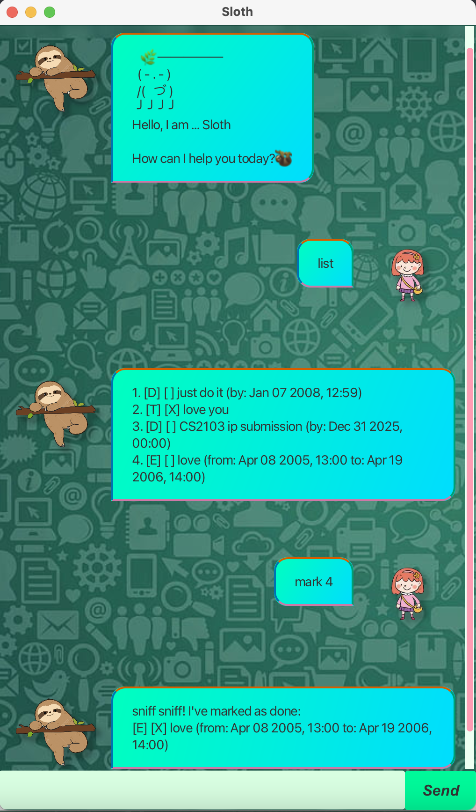

# Sloth User Guide
Meet Sloth, your laid-back task management companion who takes life one slow step at a time 🦥.

Sloth embraces a relaxed approach to organization. With gentle reminders, patient responses, and a "no rush" attitude, Sloth helps you manage your todos, deadlines, and events without the stress. Perfect for those who prefer to work at their own pace while staying organized.


## Quick Start

1. Ensure you have Java `17` or above installed on your computer
    - **Mac users:** Ensure you have the precise JDK version prescribed here: https://se-education.org/guides/tutorials/javaInstallationMac.html
2. Download `sloth.jar` from the releases page
3. Run the application using `java -jar sloth.jar`

## Features

### Adding a Todo

**Format:** `todo <description>`

**Example:**
```
todo read book
```

### Adding a Deadline

**Format:** `deadline <description> /by <date time>`

Sloth supports flexible date formats:
- `yyyy-MM-dd HH:mm` (e.g., `2025-04-18 14:30`)
- `MMM dd yyyy, HH:mm` (e.g., `Apr 18 2025, 14:30`)
- `d/M/yyyy HH:mm` (e.g., `18/4/2025 14:30`)
- Date-only formats automatically default to midnight (00:00)

**Date-only format examples:**
- `2025-04-18` becomes `2025-04-18 00:00` (midnight)
- `Apr 18 2025` becomes `Apr 18 2025, 00:00` (midnight)
- `MMM d yyyy` format like `Jan 5 2025` becomes `Jan 5 2025, 00:00`

This is perfect when you know the due date but don't need a specific time - Sloth will treat it as due at the start of that day.

**Examples:**
```
deadline return book /by 2025-04-18 18:00
deadline submit assignment /by Apr 18 2025, 23:59
deadline pay rent /by 2025-05-01
deadline doctor appointment /by Dec 15 2024
```

### Adding an Event

**Format:** `event <description> /from <start time> /to <end time>`

**Example:**
```
event project meeting /from 2025-04-18 10:00 /to 2025-04-18 12:00
```

### Listing All Tasks

**Format:** `list`

Shows all tasks currently stored.

### Marking Tasks as Done/Undone

**Format:**
- `mark <task number>` - Mark as completed
- `unmark <task number>` - Mark as incomplete

**Example:**
```
mark 2
```
Marks task #2 as completed.

### Deleting a Task

**Format:** `delete <task number>`

**Example:**
```
delete 3
```

### Finding Tasks

**Format:** `find <keyword>`

**Example:**
```
find book
```

### Sorting Tasks

**Format:** `sort`

Sorts tasks chronologically. Todos appear last as they have no time constraints.

### Exiting

**Format:** `bye`

Closes the chatbot with a friendly goodbye message.

## Command Summary

| Command | Format | Description | Example |
|---------|--------|-------------|---------|
| `todo` | `todo <description>` | Add a simple task | `todo read book` |
| `deadline` | `deadline <description> /by <date time>` | Add task with deadline | `deadline return book /by 2025-04-18 18:00` |
| `event` | `event <description> /from <start> /to <end>` | Add scheduled event | `event meeting /from 2025-04-18 10:00 /to 2025-04-18 12:00` |
| `list` | `list` | Show all tasks | `list` |
| `mark` | `mark <task number>` | Mark task as done | `mark 2` |
| `unmark` | `unmark <task number>` | Mark task as undone | `unmark 2` |
| `delete` | `delete <task number>` | Delete a task | `delete 3` |
| `find` | `find <keyword>` | Search for tasks | `find book` |
| `sort` | `sort` | Sort tasks chronologically | `sort` |
| `bye` | `bye` | Exit the application | `bye` |

## Error Handling

Sloth handles errors gracefully with helpful messages:

- `OOPS!!! I'm sorry, but I don't know what that means :-(`
- `eep! I need a task number after 'mark'. Try: mark 1`
- `nuzzz... nuzzzz.. Little sloth don't understand this date format!`

## Data Storage

Tasks are automatically saved to `data/sloth.txt`.

